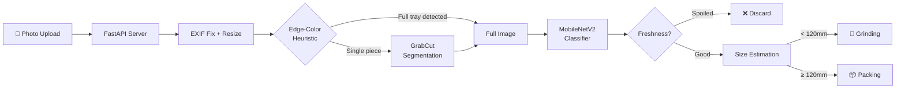

<div align="center">

# Marbl

**AI-Powered Meat Freshness Scanner**

Instant freshness classification · Physical size routing · Mobile-first web interface

[](https://python.org)
[](https://pytorch.org)
[](https://fastapi.tiangolo.com)
[](LICENSE)

</div>

---

## Overview

Marbl is an end-to-end computer vision pipeline that classifies meat freshness from a single photo. Upload an image from your phone camera or gallery, and the system returns:

- **Freshness verdict** — `good` or `spoiled` with confidence percentage
- **Routing decision** — `discard` · `grinding` · `packing` based on physical size
- **Annotated image** — visual overlay with classification badge and bounding box

Built on a **MobileNetV2** backbone trained on 3,300+ labeled images, served through a **FastAPI** backend with a mobile-first dark-mode UI.

### Key Features

| Feature | Description |
|---|---|
| 🔬 **Freshness AI** | MobileNetV2 classifier with 94.2% validation accuracy |
| 📏 **Size Measurement** | Reference-card calibration for physical mm dimensions |
| 📱 **Mobile-First UI** | Live camera capture + gallery upload with dark mode |
| 🧠 **Smart Segmentation** | Auto-detects full-tray vs. single-piece photos |
| ⚡ **GPU Accelerated** | CUDA inference for sub-100ms classification |
| 🔄 **Multi-Piece Detection** | Identifies clustered pieces and routes to grinding |

---

## Quick Start

### Prerequisites

- Python 3.10+
- pip
- (Recommended) NVIDIA GPU with CUDA for fast inference

### Installation

```bash
# Clone the repository
git clone https://github.com/SoumiryaSarangi/project-meat-analysis.git
cd project-meat-analysis

# Create virtual environment
python -m venv venv

# Activate (Windows)
venv\Scripts\activate

# Activate (macOS / Linux)
source venv/bin/activate

# Install dependencies
cd backend
pip install -r requirements.txt
```

> **GPU Acceleration:** For NVIDIA GPUs, install the CUDA-enabled PyTorch build:
> ```bash
> pip install torch torchvision --index-url https://download.pytorch.org/whl/cu128
> ```
> Verify with: `python -c "import torch; print('CUDA:', torch.cuda.is_available())"`

### Launch

```bash
cd backend
uvicorn app:app --host 0.0.0.0 --port 8000
```

Open **http://localhost:8000** in your browser.
From a phone on the same Wi-Fi: `http://<your-machine-ip>:8000`

---

## Architecture



### Pipeline Stages

| Stage | Module | Description |
|---|---|---|
| **1. Decode** | [`app.py`](backend/app.py) | EXIF orientation fix, downscale to 1280px max |
| **2. Detect Mode** | [`segmentation.py`](backend/segmentation.py) | Edge-color heuristic: if >20% of the image border is meat-colored, bypass GrabCut |
| **3. Segment** | [`segmentation.py`](backend/segmentation.py) | GrabCut foreground isolation + largest-blob selection |
| **4. Classify** | [`freshness_classifier.py`](backend/freshness_classifier.py) | MobileNetV2 inference → `good` / `spoiled` with confidence |
| **5. Size** | [`size_estimator.py`](backend/size_estimator.py) | Reference-card calibration or area-based fallback |
| **6. Route** | [`pipeline.py`](backend/pipeline.py) | Map (freshness × size) → routing decision |
| **7. Annotate** | [`annotate.py`](backend/annotate.py) | Draw bounding box + classification badge onto image |

### Design Decisions

<details>
<summary><b>Why GrabCut instead of YOLO for segmentation?</b></summary>

The original conveyor-belt design used YOLO for meat detection, but it required thousands of manually annotated bounding boxes for training. GrabCut is an unsupervised color-contrast algorithm that works out of the box with zero training data — ideal for the upload-based workflow where photos come from arbitrary cameras and angles.
</details>

<details>
<summary><b>Why the edge-color heuristic?</b></summary>

GrabCut assumes the image border is background. When users upload macro photos of full meat trays (where meat touches all edges), GrabCut crops incorrectly and causes false "good" classifications. The heuristic checks if >20% of the outer 5% border contains red/meat-colored pixels in HSV space. If so, it bypasses GrabCut entirely and sends the full uncropped image to the classifier.
</details>

<details>
<summary><b>Why downscale to 1280px?</b></summary>

Modern phone cameras produce 12MP+ images (4000×3000). GrabCut's runtime scales exponentially with resolution — a raw 12MP image takes ~20 seconds vs. ~0.2 seconds at 1280px. The downscaling is transparent to size measurement because the reference-card ratio remains constant at any resolution.
</details>

---

## API Reference

### `POST /api/classify`

Upload one or more meat photos for classification.

**Request:** `multipart/form-data` with field name `files`

**Response:**
```json
{
  "results": [
    {
      "filename": "IMG_001.jpg",
      "label": "good",
      "good_confidence": 0.9234,
      "spoiled_confidence": 0.0766,
      "decision": "packing",
      "size_category": "big",
      "size_method": "measured",
      "longest_dimension_mm": 142.3,
      "piece_count_estimate": 1,
      "box": [45, 32, 380, 290],
      "segmentation_fallback": false,
      "annotated_image_base64": "data:image/jpeg;base64,..."
    }
  ]
}
```

| Field | Type | Description |
|---|---|---|
| `label` | `string` | `"good"` or `"spoiled"` |
| `good_confidence` | `float` | Confidence score for "good" (0.0–1.0) |
| `decision` | `string` | `"discard"` · `"grinding"` · `"packing"` |
| `size_method` | `string` | `"measured"` (card found) · `"estimated"` (fallback) · `"multiple_pieces_detected"` |
| `longest_dimension_mm` | `float?` | Physical size in mm (null if spoiled or multi-piece) |
| `piece_count_estimate` | `int` | Estimated number of meat pieces |
| `annotated_image_base64` | `string?` | Base64-encoded JPEG with visual annotations |

### `GET /health`

Liveness check. Returns `{"status": "ok", "model_loaded": true}`.

---

## Size Calibration

Place a standard **credit / debit / ID card** (ISO/IEC 7810 ID-1: 85.60 × 53.98 mm) flat next to the meat in the photo. The system detects the card's rectangular contour, computes `pixels_per_mm` for that specific photo, and marks the result as `size_method: "measured"`.

Without a visible card, the system falls back to a frame-area heuristic marked `size_method: "estimated"`.

---

## Model Performance

Trained on a combined dataset of **3,331 images** (Kaggle Meat Freshness + custom footage), evaluated on **831 held-out validation images** through the full web pipeline (including segmentation):

| Metric | Value |
|---|---|
| **Overall Accuracy** | 94.2% |
| **Precision** | 95.7% |
| **Recall** | 91.0% |
| **F1 Score** | 0.933 |
| **Spoilage Detection Rate** | 96.8% |

> [!WARNING]
> **Data leakage caveat:** The train/val split was produced by `merge_datasets.py` using a plain random shuffle. If the source dataset contains near-duplicate frames (e.g., augmented copies), some may appear on both sides of the boundary, inflating accuracy. Treat these numbers as an upper bound pending a formal leakage audit.

---

## Configuration

All runtime parameters are in [`backend/config.yaml`](backend/config.yaml):

```yaml
freshness_classifier:
  device: "cuda"                       # "cuda" or "cpu"
  good_confidence_threshold: 0.60      # Safety dial: higher = stricter

size_classifier:
  size_threshold_mm: 120               # Big/small routing cutoff
  card_width_mm: 85.60                 # ISO ID-1 card width
  card_aspect_tolerance: 0.18          # Tolerance for perspective skew
  fallback_area_threshold: 0.35        # Area-based size heuristic
  multi_piece_dist_threshold: 0.5      # Piece-count sensitivity
```

| Parameter | What it controls |
|---|---|
| `good_confidence_threshold` | **Safety dial.** Raise to reject more borderline pieces (safer). Lower to accept more (fewer false rejects). |
| `size_threshold_mm` | Physical cutoff between grinding (< threshold) and packing (≥ threshold). |
| `multi_piece_dist_threshold` | Sensitivity for multi-piece detection. Lower = more sensitive, higher = fewer false positives. |

---

## Reproduce Training from Scratch

<details>
<summary><b>Click to expand full training guide</b></summary>

### Step 1 — Download the Kaggle dataset

1. Go to [Kaggle — Meat Freshness Image Dataset](https://www.kaggle.com/datasets/vinayakshanawad/meat-freshness-image-dataset)
2. Download `archive.zip` (~75 MB)

### Step 2 — Prepare the dataset

```bash
python scripts/prepare_dataset.py --zip "path/to/archive.zip"
```

This creates the following structure:
```
data/dataset_freshness/
├── train/
│   ├── good/
│   └── spoiled/
└── val/
    ├── good/
    └── spoiled/
```

> Pass `--half-fresh good` to treat borderline HALF-FRESH images as good instead of spoiled.

### Step 3 — (Optional) Add custom images

If your photos differ from the Kaggle dataset (different lighting, background, camera):

```bash
python scripts/merge_datasets.py \
    --fresh  "path/to/Fresh" \
    --spoiled "path/to/Spoiled"
```

### Step 4 — Train

```bash
# CPU (~30 min)
python scripts/train_classifier.py --data data/dataset_freshness --epochs 30

# GPU (~6-12 min, recommended)
python scripts/train_classifier.py --data data/dataset_freshness --epochs 30 --batch 64
```

The best checkpoint is saved to `models/freshness_classifier.pt`.

### Step 5 — Validate

```bash
# Run inference on validation set
python scripts/run_on_images.py \
    --images data/dataset_freshness/val \
    --out-dir output/test_annotated \
    --log-csv output/test_decisions_log.csv

# Print accuracy metrics (Precision, Recall, F1)
python scripts/analyze_results.py

# Full pipeline validation (simulates web upload flow)
python scripts/validate_pipeline.py
```

</details>

---

## Project Structure

```
marbl/
├── backend/                          # FastAPI web server
│   ├── app.py                        # HTTP server — routes, EXIF handling, image resize
│   ├── pipeline.py                   # Per-image orchestrator (segment → classify → size → decide)
│   ├── segmentation.py               # GrabCut isolation + edge-color heuristic
│   ├── freshness_classifier.py       # MobileNetV2 classifier wrapper
│   ├── size_estimator.py             # Reference-card calibration + area fallback
│   ├── annotate.py                   # Visual annotation renderer
│   ├── config.yaml                   # Runtime configuration
│   ├── test_pipeline.py              # Regression test suite
│   └── requirements.txt              # Backend dependencies
│
├── frontend/
│   └── index.html                    # Single-file mobile-first UI (camera + upload + results)
│
├── scripts/                          # Training & evaluation utilities
│   ├── prepare_dataset.py            # Extract & organize the Kaggle zip
│   ├── merge_datasets.py             # Mix additional images into train/val
│   ├── train_classifier.py           # Train the freshness CNN
│   ├── run_on_images.py              # Batch inference on image folders
│   ├── analyze_results.py            # Compute accuracy metrics from CSV
│   ├── validate_pipeline.py          # Full pipeline regression test
│   ├── collect_data.py               # Webcam capture tool for dataset building
│   └── verify_camera_feature.py      # Browser camera feature test
│
├── models/
│   └── freshness_classifier.pt       # Trained model weights (~9 MB)
│
├── legacy/                           # Retired conveyor belt code (reference only)
│   ├── pipeline_conveyor.py          # Original real-time camera loop
│   ├── detector.py                   # YOLO detector wrapper
│   ├── router.py                     # Serial / MQTT hardware signalling
│   ├── tracker.py                    # Centroid tracker for belt pieces
│   └── README.md                     # Revival instructions
│
├── requirements.txt                  # Root-level dependencies (training)
└── README.md
```

---

## Camera & HTTPS

The web app supports two input methods: **live camera capture** and **file upload**.

| Scenario | File Upload | Camera |
|---|---|---|
| `http://localhost:8000` | ✅ | ✅ |
| `http://<lan-ip>:8000` (phone) | ✅ | ❌ blocked by browser |
| `https://` (any origin) | ✅ | ✅ |

> Browsers require a [Secure Context](https://developer.mozilla.org/en-US/docs/Web/Security/Secure_Contexts) for camera access. `localhost` is exempt; all other origins must use HTTPS.

### Testing on a Phone

The fastest approach is an HTTPS tunnel:

```bash
# Install ngrok: https://ngrok.com/download
ngrok http 8000
```

Open the printed `https://xxxxx.ngrok-free.app` URL on your phone. The rear camera opens by default.

### Production Deployment

For a permanently reachable service:
- **Reverse proxy** (nginx / Caddy) with a TLS certificate (Let's Encrypt), or
- **Hosting platform** with built-in HTTPS (Railway, Render, Fly.io)

---

## Known Limitations

| Area | Limitation |
|---|---|
| **GrabCut** | Segments by color contrast — unusual backgrounds or very dark meat may cause mis-segmentation (automatic fallback applied) |
| **Card Detection** | Contour-based; other rectangular objects (cutting board, phone case) can be mistaken for the reference card |
| **Size Threshold** | `120mm` is an unvalidated placeholder — calibrate against your actual product sizes |
| **Multi-Piece** | Distance-transform heuristic, not a trained segmenter. Nearby same-colored pieces may merge into one blob |
| **Validation** | Random train/val split may contain data leakage from near-duplicate images |

---

## Future Work

- **Instance segmentation** (YOLOv8-seg / Mask R-CNN) for reliable multi-piece measurement
- **Data augmentation** extensions: `RandomCrop`, `GaussianBlur` for motion-blur robustness
- **Active learning** pipeline to flag low-confidence predictions for human review
- **Multi-class grading** beyond binary good/spoiled (e.g., fresh → borderline → spoiled)

---

## Tips

> [!TIP]
> **Lighting matters more than model choice.** Inconsistent lighting will hurt accuracy far more than swapping architectures. Use fixed, diffuse, consistent-color-temperature lighting.

> [!TIP]
> **`good_confidence_threshold` is your safety dial.** Raise it to discard more borderline pieces (safer) at the cost of more false rejects.

> [!TIP]
> **Add your own photos!** Use `scripts/collect_data.py` to capture images and `scripts/merge_datasets.py` to mix them into training. This is the single biggest lever for accuracy on your specific setup.

---

<div align="center">

Built with ❤️ using PyTorch · FastAPI · OpenCV

</div>
